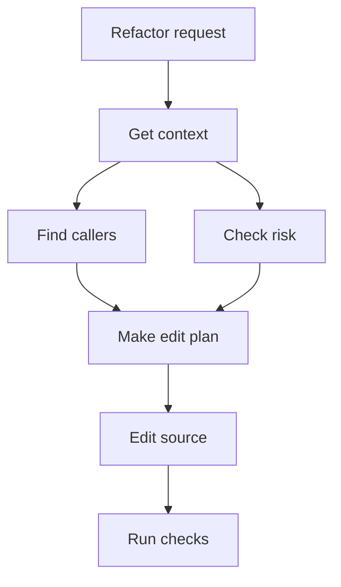

# Common Workflows

## Find Where A Feature Lives

```bash
provenant ask "Where is playlist persistence implemented?" --path .
```

Then ask the MCP server for focused context around the returned files.

## Prepare For A Refactor

Ask the agent to call Provenant for:

- relevant files
- symbols exported by the module
- callers and dependencies
- risk and hotspot signals



## Investigate A Failing Test

Start from the test name, stack trace, or failing behavior:

```bash
provenant search "failing test name or error text" .
```

Use the returned files as a reading list, not as a final answer.

## Review A Risky Change

Use risk and graph context before editing central modules:

```text
Ask Provenant: What depends on this file, and what is the likely blast radius?
```

Then run the relevant test slice.

## Measure Agent Cost Over Time

After using the agent with Provenant MCP:

```bash
provenant usage sync .
provenant usage report . --by session
```

Open the Usage tab in the dashboard for assisted versus unassisted session comparison.

