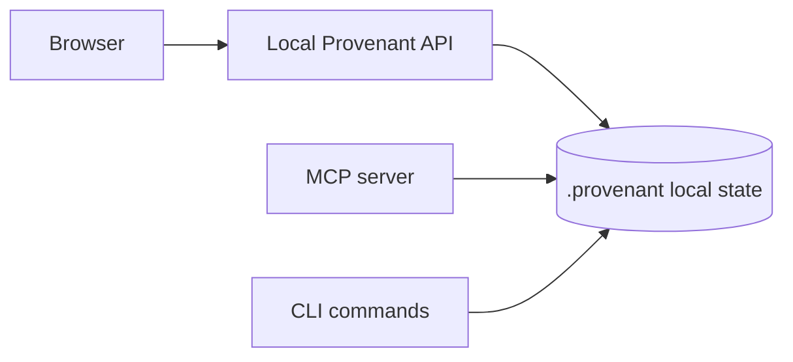

# Dashboard

The local dashboard gives developers a browser view over the same repo-local Provenant state used by MCP.

Start it with:

```bash
provenant serve .
```

Stop it with:

```bash
provenant serve --stop
```

## What The Dashboard Is For

Use the dashboard when you want to inspect repository intelligence directly instead of relying on an agent response.

Common dashboard tasks:

- search indexed repo knowledge
- inspect generated pages
- explore graph and dependency context
- review risk and dead-code signals
- import and inspect usage telemetry
- validate whether the repo index is current

## Dashboard Data Flow



## Usage Tab

The Usage tab depends on `ccusage`.

If `ccusage` is available, the tab can show token totals, estimated cost, breakdowns, and observed Provenant-assisted savings.

If `ccusage` is missing, the tab shows:

```bash
npm install -g ccusage
provenant usage sync
```

MCP and search features continue to work without `ccusage`.

## Local-Only Assumption

The dashboard is designed for local development. Do not expose it publicly unless you have added the network and access controls your environment requires.

