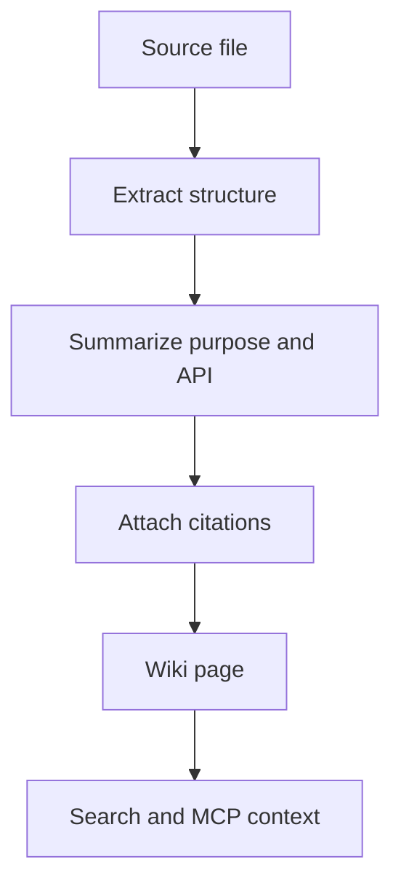

# Generated Wiki

The generated wiki is the human-readable layer Provenant builds for a repository.

## What A Page Contains

A wiki page can include:

- the file's purpose
- important functions, classes, or exports
- public API notes
- dependencies and related files
- implementation details that affect maintenance
- citations back to source files

The wiki is not meant to replace source code. It gives agents and developers a compact map before they inspect the implementation.

## Why It Matters

Raw file retrieval often misses intent. The wiki turns implementation details into searchable explanations, which improves natural-language retrieval.



## Quality Signals

Provenant tracks attribution confidence as:

```text
cited_pages / retrieved_pages
```

Low-confidence answers are a signal that the retrieved context may be incomplete. This gives Provenant a way to identify weak areas in the local knowledge layer.

## Editing Generated Pages

Generated pages are runtime artifacts. If a page looks stale or weak, prefer refreshing the index with:

```bash
provenant update .
```

Manual edits inside `.provenant/` may be overwritten by future updates.

