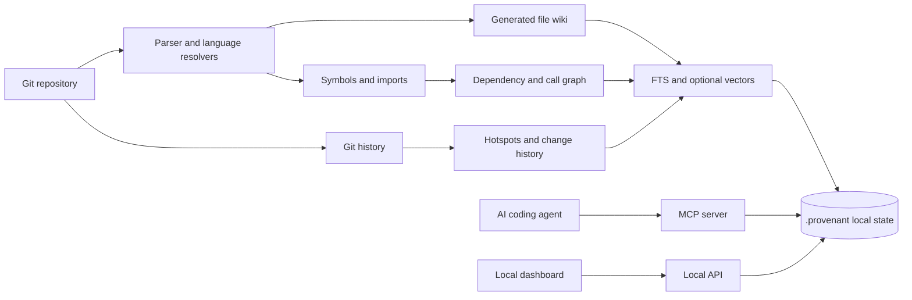
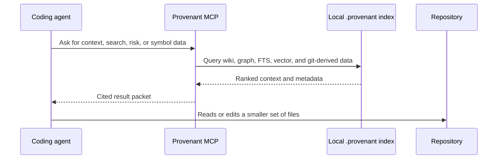

# How Provenant Works

Provenant builds a local knowledge layer from the repository, then serves that layer to humans and agents.

## Architecture



## Indexing

`provenant init` creates the repo-local `.provenant/` directory. During init, Provenant parses files, records symbols and relationships, generates or stores wiki/context pages depending on the selected mode, and builds retrieval state.

For semantic search, Provenant can use a local embedder or a hosted embedder. Local embeddings avoid an API key and keep embedding work on the machine. Hosted embeddings can improve retrieval quality, but they require the selected provider's API key.

## Querying

An agent connects to Provenant through MCP:

```bash
provenant mcp /path/to/repo
```

The MCP server opens the local index and exposes tools such as search, answer, context, symbol, risk, overview, dead code, and why. The tools return focused context with citations and metadata, so the agent can decide what to read or edit next.

## Dashboard

The local dashboard is served by:

```bash
provenant serve /path/to/repo
```

The API and web UI run from the same local server. The dashboard reads the same `.provenant/` state as the MCP server.

## Agent Request Lifecycle



## Updating

After the repo changes, use `provenant update` to refresh the index. Provenant also has hook and watch commands for teams that want the index to stay current during normal development.

