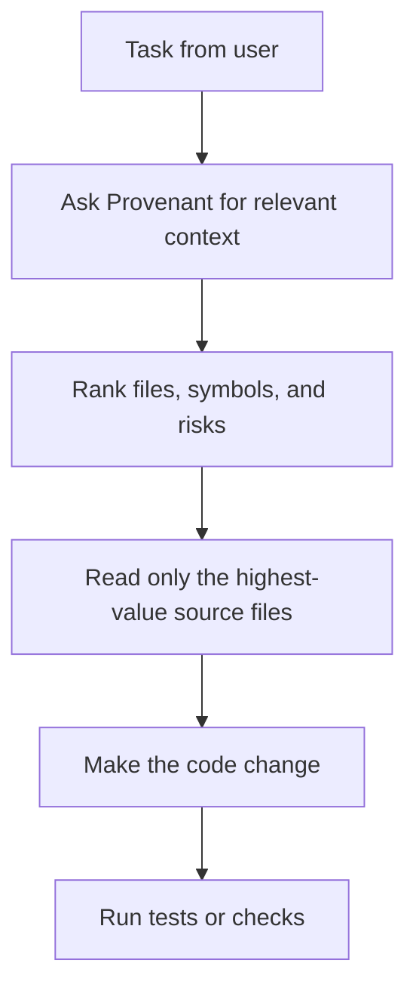

# MCP Tools

Provenant exposes repository intelligence through MCP so coding agents can ask for structured context instead of manually scanning the repo.

## Tool Categories

| Category | What The Agent Gets |
|---|---|
| Search | Ranked files and wiki/context pages for a natural-language query. |
| Answer | A cited answer built from retrieved repo context. |
| Context | Focused context packets for files, symbols, and related code. |
| Symbol | Symbol-level lookup for definitions and surrounding code. |
| Risk | Change-risk, hotspot, and blast-radius signals. |
| Overview | Repository or workspace summaries. |
| Dead code | Candidates that appear unused or unreachable, with caveats. |
| Why | Historical and structural explanation for why a file or module exists. |

The exact tool set can grow, but the contract is stable: agents call Provenant for repo-specific context, and Provenant returns compact, cited data from the local index.

## Recommended Agent Behavior

Use Provenant before broad file reads:



Good first questions:

- "Which files implement this behavior?"
- "What code paths call this function?"
- "What is the risk of changing this module?"
- "Give me context for these files before I edit them."
- "Why does this package exist, and what depends on it?"

## Stdio And SSE

Most local coding-agent clients use stdio:

```bash
provenant mcp /path/to/repo
```

For web-based MCP clients, Provenant can also start an SSE transport:

```bash
provenant mcp /path/to/repo --transport sse --port 7338
```

## Workspace Notes

If a directory has been initialized as a workspace, MCP can serve the configured repositories through the workspace registry. This is useful when a task crosses service or package boundaries.

## Practical Limits

MCP results are retrieval results, not proof. Treat them as a better starting point for agent work. The agent should still inspect source, run tests, and avoid editing code it has not validated.

