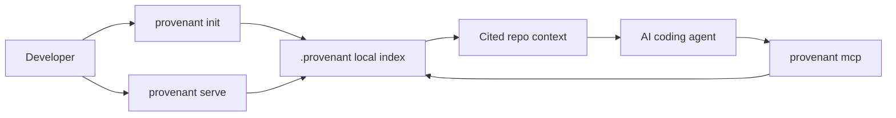

# Overview

Provenant is a local repository intelligence layer for AI coding agents.

It indexes a repository, builds a compact knowledge layer around the code, and exposes that knowledge through an MCP server and local dashboard. The goal is simple: when an agent needs codebase context, it should retrieve the few relevant files, symbols, relationships, and history records instead of reading broad chunks of the repository.

## What It Helps With

- Find relevant files for a bug, feature, or refactor request.
- Ask cited questions about how a code path works.
- Pull symbol, dependency, caller, and risk context before editing.
- Surface dead-code candidates and change blast radius signals.
- Track whether Provenant-assisted sessions appear to reduce coding-agent token and cost usage.

## What It Is Not

Provenant is not a hosted code scanner by default. The index lives under the target repository's `.provenant/` directory, and the local server serves the dashboard from the same machine.

Provenant is also not a replacement for tests, code review, or a controlled benchmark. Its usage savings view compares local coding-agent usage with Provenant tool activity. That makes it useful for day-to-day cost visibility, but it should be read as operational telemetry unless you run a controlled baseline.

## Core Flow

## Where Provenant Fits

Provenant sits between the repository and the coding agent. The agent still makes decisions and edits files. Provenant gives it a better map: file summaries, symbols, graph edges, git history, risk signals, and retrieved context packets that are smaller than raw repository reads.

## Evidence Snapshot

The current evaluation uses SWE-bench Verified: 500 real GitHub issues across 12 Python repositories.

| Metric | Baseline | Provenant | Delta |
|---|---:|---:|---:|
| File Coverage@5, wiki BM25 | 56.2% | 63.8% | +7.6 pp |
| File Coverage@5, reranker + selective HyDE | 56.2% | 66.2% | +10.0 pp |
| File Coverage@10, reranker + selective HyDE | 69.0% | 75.2% | +6.2 pp |
| MRR, reranker + selective HyDE | 0.404 | 0.454 | +0.050 |

Token reduction was measured on Flask and Django question-answering workloads. Flask used 1,070 wiki tokens versus 69,044 naive source tokens. Django used 994 wiki tokens versus 59,634 naive source tokens.

