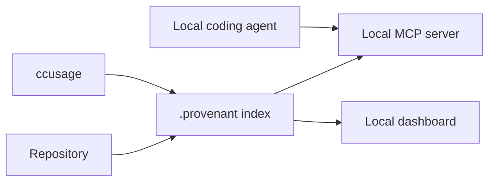

# Privacy And Security

Provenant is local by default.

The repository index, generated context, usage snapshots, and dashboard data live under the target repo's `.provenant/` directory or the local Provenant configuration directory. The default workflow does not require uploading source code to a Provenant cloud service.

## Local Data Flow



## What May Leave The Machine

That depends on the options you choose:

| Feature | Leaves The Machine? | Notes |
|---|---|---|
| Local indexing | No | Repository state is written locally. |
| Local embedder | No | Runs local embedding model. |
| Hosted embedder | Yes | Text sent to the configured embedding provider. |
| LLM-generated docs or answers | Yes, if using hosted provider | Requests go to the provider configured by the user. |
| `ccusage` offline sync | No Provenant upload | Provenant imports local `ccusage` JSON. |
| `ccusage --online` | Depends on ccusage behavior | Used to refresh pricing data. |

## ccusage

`ccusage` is optional. Provenant can operate without it.

If `ccusage` is missing:

- `provenant usage sync` reports that `ccusage` is not installed unless `--use-npx` is passed.
- the local Usage tab shows install instructions instead of empty charts
- MCP, search, context, risk, and dashboard features continue to work

Install later with:

```bash
npm install -g ccusage
```

## Generated Files

Provenant writes generated state under `.provenant/`. Treat that directory as local runtime state unless your team has explicitly decided to version it.

Recommended `.gitignore` entry for application repositories:

```gitignore
.provenant/
```

## Access Model

The local dashboard and API run on the developer's machine. Do not bind the server to a public interface unless you understand the network exposure and trust the clients that can reach it.

For local use:

```bash
provenant serve /path/to/repo
```

Stop the server:

```bash
provenant serve --stop
```

