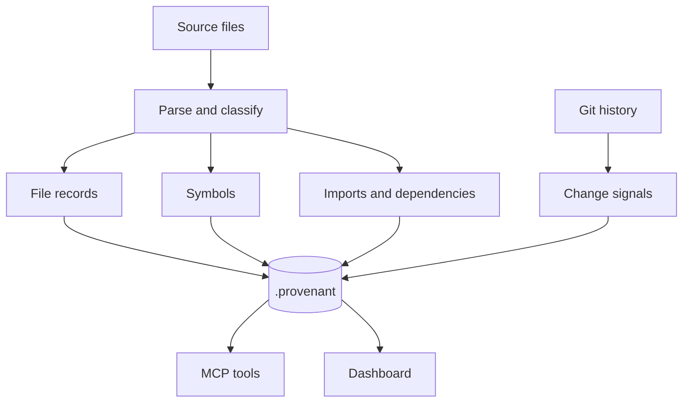

# Repository Index

The repository index is Provenant's local memory for a codebase.

## What Gets Indexed

Provenant reads source files, repository metadata, and git history. It stores the derived knowledge needed for retrieval and dashboard views:

- file records
- wiki/context pages
- symbols and definitions
- import and dependency relationships
- full-text search data
- optional vector data
- git-derived change and hotspot signals
- MCP usage events
- optional ccusage snapshots

## Data Flow



## Where It Lives

For a repository at `/path/to/repo`, Provenant writes:

```text
/path/to/repo/.provenant/
```

This directory is the local source of truth for Provenant's repo intelligence.

## When To Rebuild

Use `provenant update` after normal development changes. Use a fresh `provenant init` when you want to rebuild setup choices or initialize a new repository.

## What Not To Assume

The index is a retrieval layer, not a compiler. If source parsing is incomplete for a dynamic pattern, Provenant can still provide useful search and history context, but agents should validate important findings against the source and tests.

