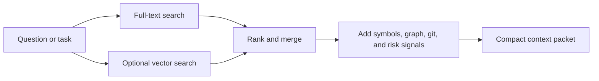

# Retrieval Model

Provenant retrieves from a code-aware representation of the repository instead of treating every source file as an isolated text blob.

## Why Wiki-Based Retrieval

Developer questions are usually phrased in natural language:

```text
Where is request authorization enforced?
```

Source code is often phrased in identifiers and framework conventions:

```text
before_request
permission_classes
requireRole
validateSession
```

Generated wiki/context pages bridge that vocabulary gap. They describe file purpose, public API, relationships, and implementation notes in language that is easier to retrieve against.

## Retrieval Pipeline



## Ranking Signals

Depending on the command and available index data, Provenant can use:

- full-text matches
- embedding similarity
- file and symbol relationships
- caller and dependency edges
- repository history
- hotspots and risk scores
- attribution confidence from cited pages

## Output Shape

Good retrieval output is small enough for an agent to use and specific enough for a developer to verify. Provenant favors cited context packets over long generic summaries.

## Evaluation Context

On SWE-bench Verified, Provenant's wiki BM25 retrieval reached 63.8% File Coverage@5 compared with 56.2% for raw BM25 over source files. With reranking and selective HyDE, Coverage@10 reached 75.2%.

