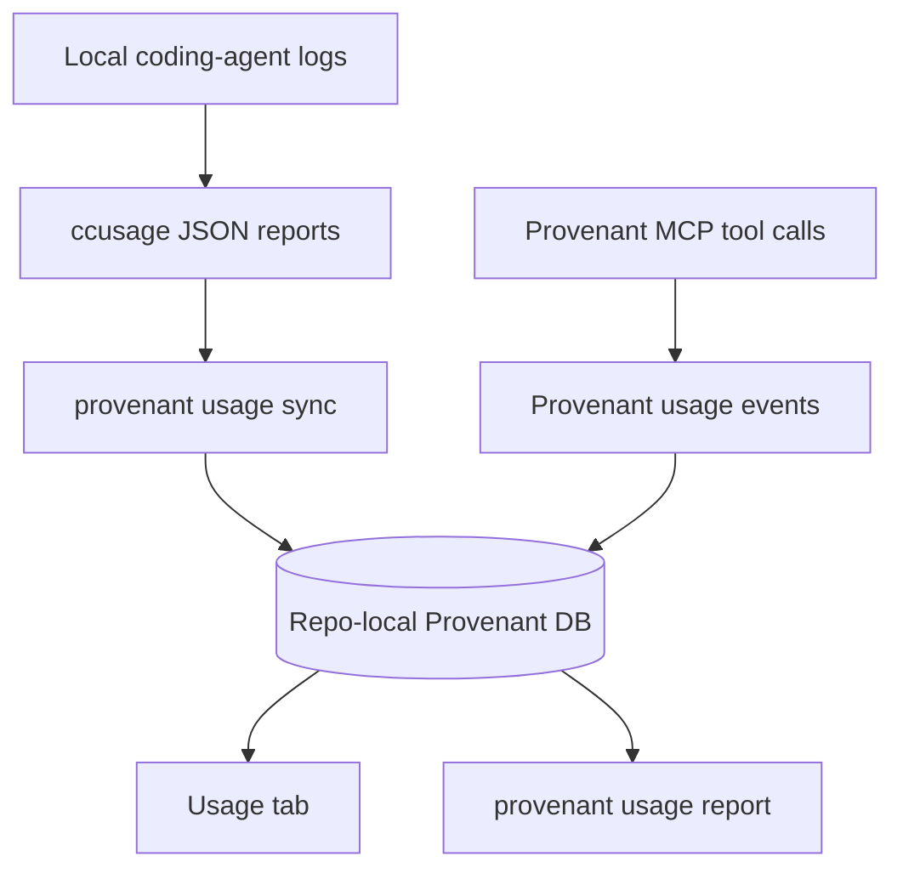
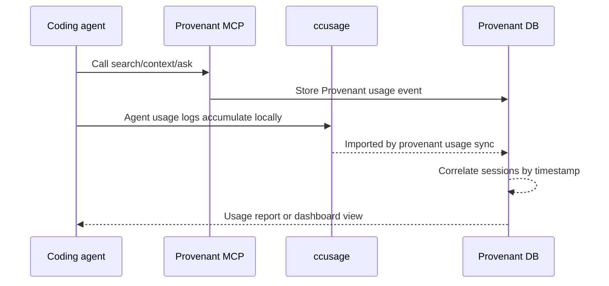

# Usage And Savings

Provenant can import local coding-agent usage through `ccusage` and compare it with Provenant MCP activity. This lets teams see whether indexed repo context is associated with lower token usage and lower estimated agent cost over time.

## What ccusage Adds

`ccusage` reads local usage logs from supported coding-agent CLIs and reports token and estimated cost data. Provenant does not reimplement that accounting. It imports normalized `ccusage` JSON into the repo-local Provenant database.

Provenant adds the part `ccusage` does not know: whether Provenant MCP tools were used during an agent session.



## Install

During `provenant init`, Provenant may ask:

```text
Install ccusage now?
```

If accepted, Provenant runs:

```bash
npm install -g ccusage
```

If skipped, install it later:

```bash
npm install -g ccusage
```

Then sync:

```bash
provenant usage sync /path/to/repo
```

If you do not want a global install, the sync command can run through `npx`:

```bash
provenant usage sync /path/to/repo --use-npx
```

By default, Provenant asks `ccusage` to run offline during sync. Use `--online` only when you want `ccusage` to refresh pricing data.

## What The Usage Tab Shows

When `ccusage` is available, the local dashboard Usage tab shows:

- total input, output, cache, and combined tokens
- estimated cost from `ccusage`
- breakdown by day, project, agent, model, and session
- observed Provenant-assisted sessions
- observed token and cost deltas between assisted and unassisted sessions

When `ccusage` is missing, the Usage tab does not pretend data exists. It shows the install and sync commands:

```bash
npm install -g ccusage
provenant usage sync
```

## How Assisted Sessions Are Detected

Provenant records MCP tool events for selected tools such as ask, context, search, and overview. During `provenant usage sync`, Provenant compares those event timestamps with `ccusage` session windows.

If a `ccusage` session has a Provenant tool event within the session window, with a small tolerance, Provenant marks it as Provenant-assisted. Sessions without a matching event are marked unassisted.



## Read The Savings Number Carefully

The local savings view is operational telemetry. It is not a randomized benchmark. It answers:

"In this repo, are sessions that used Provenant MCP cheaper than sessions that did not?"

It does not automatically prove:

"Provenant caused every dollar of the difference."

For a stronger claim, run a controlled benchmark with comparable tasks, the same agent, the same model, and a baseline period before Provenant is used.

## CLI Reporting

Sync usage:

```bash
provenant usage sync /path/to/repo
```

Report usage:

```bash
provenant usage report /path/to/repo --by day
provenant usage report /path/to/repo --by project
provenant usage report /path/to/repo --by agent
provenant usage report /path/to/repo --by model
provenant usage report /path/to/repo --by session
```

Machine-readable report:

```bash
provenant usage report /path/to/repo --json
```

