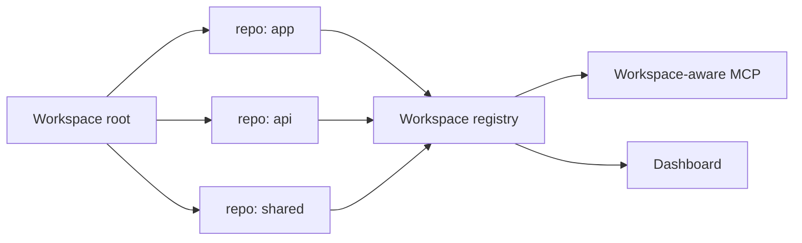

# Workspaces

Workspaces let Provenant understand multiple related repositories from one root.

Use a workspace when a task crosses boundaries:

- frontend and backend repos
- service and SDK repos
- app and shared package repos
- infra and application repos

## Workspace Flow



## Initialize

Use the workspace commands exposed by the CLI:

```bash
provenant workspace --help
```

For a single repo, `provenant init .` is enough. For a multi-repo workspace, initialize from the workspace root so Provenant can register aliases and cross-repo relationships.

## Repository Aliases

Workspace repos are addressed by alias. Aliases make agent requests shorter and avoid ambiguous paths when multiple repos have similarly named files.

## Cross-Repo Signals

When workspace data is available, Provenant can enrich context with:

- package dependency relationships
- co-change signals across repos
- service boundary hints
- contract links

## Practical Advice

Start with the repo where agent work happens most often. Add workspace setup when cross-repo questions become common enough to justify the extra indexing time.

